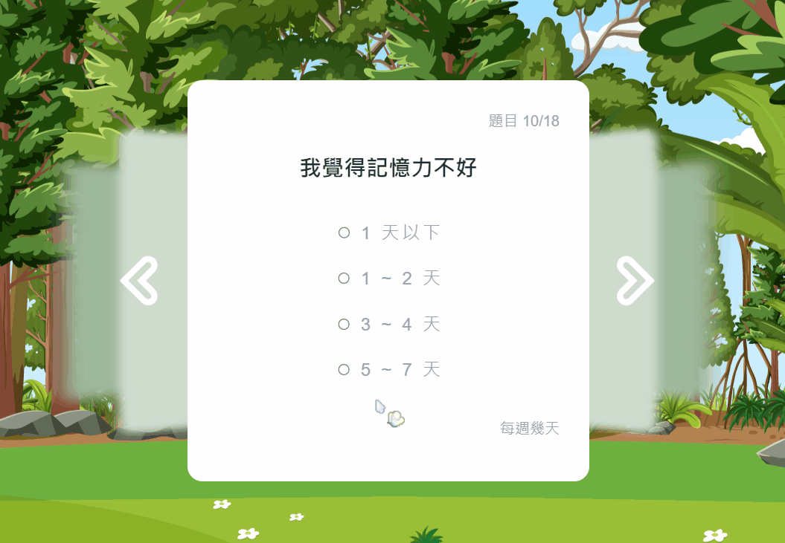
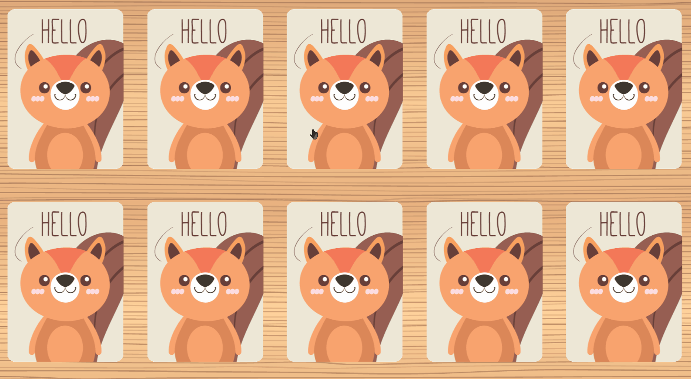
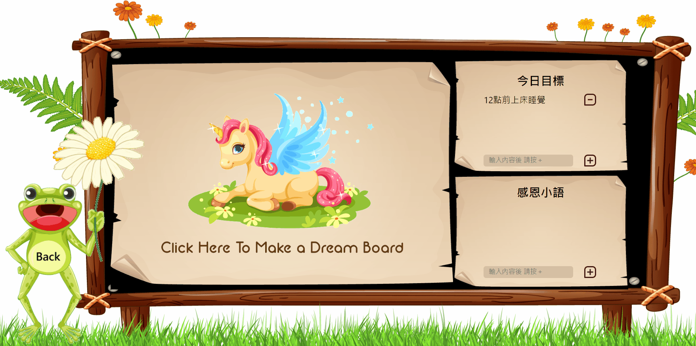
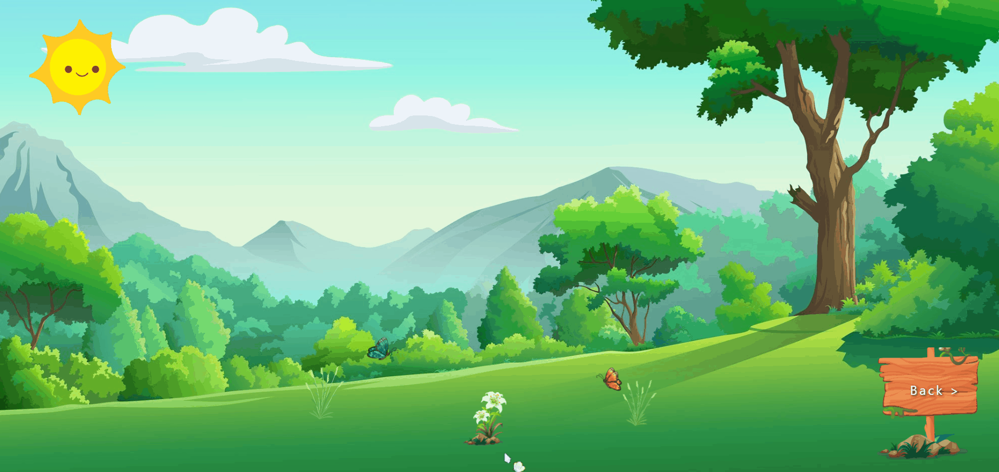

#  Spiritual forest
> A website with cute animals that can help people with depression to ease their negative emotions. Most features are derived from articles and advice from psychiatrists, psychotherapists. It can soothe everyone's heart.

## Introduction
<ul>
<li><a href="#Website-Navigation">Positive quotes.</a></li>
<li><a href="#Psychological-Test">Psychological test.</a></li>
<li><a href="#Pick-a-card-for-a-relaxation-activity">Randomly pick a card for a relaxation activity.</a></li>
<li><a href="#map">Provide place search and navigation service.</a></li>
<li><a href="#make-a-dream-board-image-editor">Make a Dream Board with image editor.</a></li>
<li><a href="#Post-a-mood-article">Post a mood article</a></li>
<li><a href="#View-historical-articles">Interactive mood article visualized with graceful plants.</a></li>
</ul> 

## Try It Now
Website Link: <https://forest-406b4.web.app/> 
Click right now and relieve your tension !  
##### <em>Note: For full experiences, please allow location access and sign in. </em>

## Techniques
+ Front-End Fundamental
  + HTML 5 / CSS 3 / JavaScript ES6
  + Responsive Web Design (RWD)
+ Frameworks & Library
  + React (Hooks)
  + React Router
  + React Spring
  + React Joyride
  + Prop-Types
  + Styled Components
+ Firebase
  + Authentication
  + Cloud Firestore
  + Storage
  + Hosting
+ Packages
  + react-spring
  + react-icons
  + react-joyride
  + react-mixitup
  + react-google-maps/api
  + use-places-autocomplete"
  + toast-ui/react-image-editor
  + tui-image-editor
  + lodash
  + uuid
  + sweetalert2
+ Other
  + Tool: ESLint / husky / Sass
  + Version Control : Git / GitHub

## Features Demo
### Website Navigation 
+ Implemented website navigation with React Joyride.
&emsp; 

### Psychological Test
+ Gorgeous quiz animations and different suggestions based on quiz results
&emsp;

+ DIntegrated Google Maps API: Places and Direction service to provide place search and navigation functions.
&emsp;

### Pick a card for a relaxation activity
+ Randomly pick a card for a relaxation activity.
&emsp;

### Make a Dream Board (image editor)
+ Make photos of your ideal life.
+ Setting daily goals and fostering positive thinking.
&emsp;

### Post a mood article
+ Tell the owl about your troubles and sadness.
+ Share happy things with parrots.
&emsp;

## View historical articles
+ Interactive mood article visualized with graceful plants.
&emsp;

## Contact  
If you have any suggestion, feel free to reach out.  
Grace Chen / grace.chen.610@gmail.com
